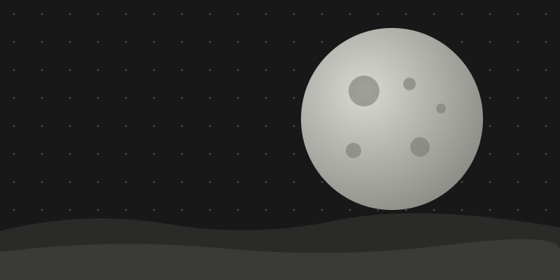

This post is here to show what the theme covers. Everything below is ordinary Markdown, which Astro turns into plain semantic HTML, and LunarCSS styles that HTML with element selectors only. Where Markdown has no syntax for an element, the post falls back to raw HTML, which Markdown passes straight through.

## Headings

The post title is the page's only `h1`, so headings inside a post start at `h2`. LunarCSS marks `h1` to `h3` with slanted bars, one bar per level. `h4` to `h6` have no mark.

### A third-level heading

#### A fourth-level heading

##### A fifth-level heading

###### A sixth-level heading

## Paragraphs and inline text

A paragraph can hold **bold text**, _italic text_, **_both at once_**, ~~struck-out text~~, `inline code` and a [link to another post](../building-a-classless-theme/). Links are chips: a tint with an accent underline and a cut corner, which fill with the accent from the left on hover and focus. [A link long enough to wrap onto a second line on a phone keeps its chip on every line it touches](../cascade-layers-let-your-css-win/).

A link that opens in a new tab gets an arrow, and screen readers hear "(opens in a new tab)": <a href="https://github.com/nikolaiwu/lunarcss" target="_blank" rel="noopener">LunarCSS on GitHub</a>.

Raw HTML covers the inline elements Markdown has no syntax for: press <kbd>Cmd</kbd> + <kbd>K</kbd>, <mark>highlight a phrase</mark>, expand <abbr title="Cascading Style Sheets">CSS</abbr>, write H<sub>2</sub>O and x<sup>2</sup>, add <small>small print</small>, name a variable <var>n</var>, show program output as <samp>Build complete</samp>, or <q>quote something inline</q>.

A backslash at the end of a line\
forces a line break without starting a new paragraph.

## Lists

An unordered list, three levels deep. The bullets are ticks that grow longer with each level:

- Tokens
  - Colours
    - `--lunar-light` and `--lunar-dark`
    - `--lunar-accent`
  - Spacing
- Elements
- Layout

An ordered list. The numbers are zero-padded and set in the mono font, then letters, then roman numerals:

1. Install the package
2. Import the stylesheets
   1. Fonts
   2. Theme
      1. Tokens
      2. Elements
   3. Layout
3. Write plain HTML

A task list, from GitHub-flavoured Markdown:

- [x] Write the sample posts
- [x] Check them in light mode
- [ ] Check them in dark mode
- [ ] Check them on a phone

A definition list, in raw HTML. LunarCSS sets it out like a spec sheet, with a dotted leader after each term:

<dl>
  <dt>Classless</dt>
  <dd>Styled through element selectors, so plain HTML needs no class attributes.</dd>
  <dt>Cascade layer</dt>
  <dd>A named group of rules. Unlayered CSS beats every layer, whatever the specificity.</dd>
  <dt>Token</dt>
  <dd>A custom property such as <code>--lunar-accent</code>, set once and used everywhere.</dd>
  <dd>Override one on <code>:root</code> to restyle the whole theme.</dd>
</dl>

## Quotes

> The theme styles elements but never places them; page structure belongs in the optional layout stylesheet.
>
> <cite>LunarCSS contributor notes</cite>

A quote can hold more than one paragraph, and other quotes:

> Unlayered CSS always wins.
>
> > That's the whole point of the layer.

## Code

Inline `code` and `<kbd>` share the cut-corner chip. Fenced code blocks are highlighted at build time, so no JavaScript runs in the browser.

CSS, overriding one token:

```css
:root {
  --lunar-accent: light-dark(#7c3aed, #a78bfa);
}
```

HTML, a card:

```html
<article>
  <header>
    <h3>C-137 Warp Drive</h3>
  </header>
  <p>Our workhorse drive. Cruises at 1.8 light years per day.</p>
  <footer>
    <a href="#contact">Request specs</a>
  </footer>
</article>
```

JavaScript, a trip planner for that warp drive:

```js
const cruiseSpeed = 1.8; // light years per day

function travelDays(distance) {
  return Math.ceil(distance / cruiseSpeed);
}

console.log(`Proxima Centauri: ${travelDays(4.24)} days`);
```

A shell command:

```bash
pnpm add @nikolaiwu/lunarcss
```

JSON, the drive's spec sheet:

```json
{
  "model": "C-137",
  "cruiseSpeed": 1.8,
  "unit": "light years per day",
  "inStock": true,
  "warranty": null,
  "destinations": ["Proxima Centauri", "Barnard's Star"]
}
```

The published stylesheet is minified into one very long line; here's how it starts. A code block scrolls sideways instead of stretching the page:

```css
@layer lunarcss{:root{color-scheme:light dark;--color-warm-white: #ece8e3;--color-meteorite-black: #2a2c2f;--color-solar-orange: #ff5623;--lunar-light: var(--color-warm-white);--lunar-dark: var(--color-meteorite-black);--lunar-bg: light-dark(var(--lunar-light), var(--lunar-dark));--lunar-fg: light-dark(var(--lunar-dark), var(--lunar-light));--lunar-accent: var(--color-solar-orange);--lunar-muted-mix: 50%;
```

## Tables

Tables read as a data sheet: a heavy top rule, mono header cells with a tick ruler marking where each column starts, and tabular figures so digits line up.

| Token               | Value      | Pixels |
| ------------------- | ---------- | -----: |
| `--lunar-text-xs`   | `0.75rem`  |     12 |
| `--lunar-text-sm`   | `0.875rem` |     14 |
| `--lunar-text-base` | `1rem`     |     16 |
| `--lunar-text-lg`   | `1.125rem` |     18 |
| `--lunar-text-xl`   | `1.25rem`  |     20 |
| `--lunar-text-2xl`  | `1.5rem`   |     24 |

A wide table, with more columns than a phone screen can hold:

| Element      | Partial                     | Drawn with                                          | Pseudo-elements used   | In forced colours                          | Notes                                                        |
| ------------ | --------------------------- | --------------------------------------------------- | ---------------------- | ------------------------------------------ | ------------------------------------------------------------ |
| `article`    | `elements/_article.scss`    | The `card` mixin: a cut-corner border and fill      | `::before`, `::after`  | Its border layers opt out of forcing       | Its `header` gets a dashed rule, its `footer` a striped band |
| `button`     | `elements/_buttons.scss`    | `clip-path` on the element, plus diagonal gradients | None                   | Falls back to a plain bordered rectangle   | Focus is a heavier edge, since the clip would cut an outline |
| `pre`        | `elements/_pre.scss`        | `clip-path`, bracket and diagonal background layers | None                   | Opts out of forcing; the accent edge shows | Scrolls sideways; focusable when it overflows                |
| `blockquote` | `elements/_blockquote.scss` | A striped band and a tinted panel                   | `::before` (the panel) | Opts out of forcing                        | No italic: Space Grotesk ships none                          |
| `ul > li`    | `elements/_lists.scss`      | A tick that grows with nesting                      | `::before`             | Opts out of forcing                        | `list-style-type: ""` keeps VoiceOver's list semantics       |
| `a`          | `elements/_a.scss`          | A gradient chip with `box-decoration-break: clone`  | `::after` (new-tab)    | The arrow mask opts out of forcing         | The chip repeats on every line of a wrapped link             |

## Images

Markdown images are optimized by Astro at build time. This one is an SVG, so it's copied as-is:



Markdown has no syntax for captions, and Astro doesn't process a local image inside raw HTML, so captioned figures live in MDX. See [Figures and captions in MDX](../figures-and-captions/).

## Footnotes

Footnotes come from GitHub-flavoured Markdown.[^layers] Each reference links down to its note, and each note links back up.[^oklch]

[^layers]: Unlayered CSS beats every cascade layer, so a site's own stylesheet always overrides the theme, whatever the selectors' specificity.

[^oklch]: Derived colours are mixed at runtime with `color-mix(in oklch, …)`, so overriding the main colours carries through to everything mixed from them.

## Details and summary

<details>
<summary>Why does the theme have no italic in blockquotes?</summary>

Space Grotesk ships no italic, so the browser would have to synthesize one by slanting the upright letters.

</details>

<details>
<summary>Why are the details joined together?</summary>

Adjacent `details` elements join into one list: neighbours share a border, and only the two ends of the run are rounded.

</details>

## Horizontal rule

A horizontal rule is a dotted band:

---

That's every element. If one of them looks wrong, it's a gap in the theme, and it gets fixed in LunarCSS, not patched here.
